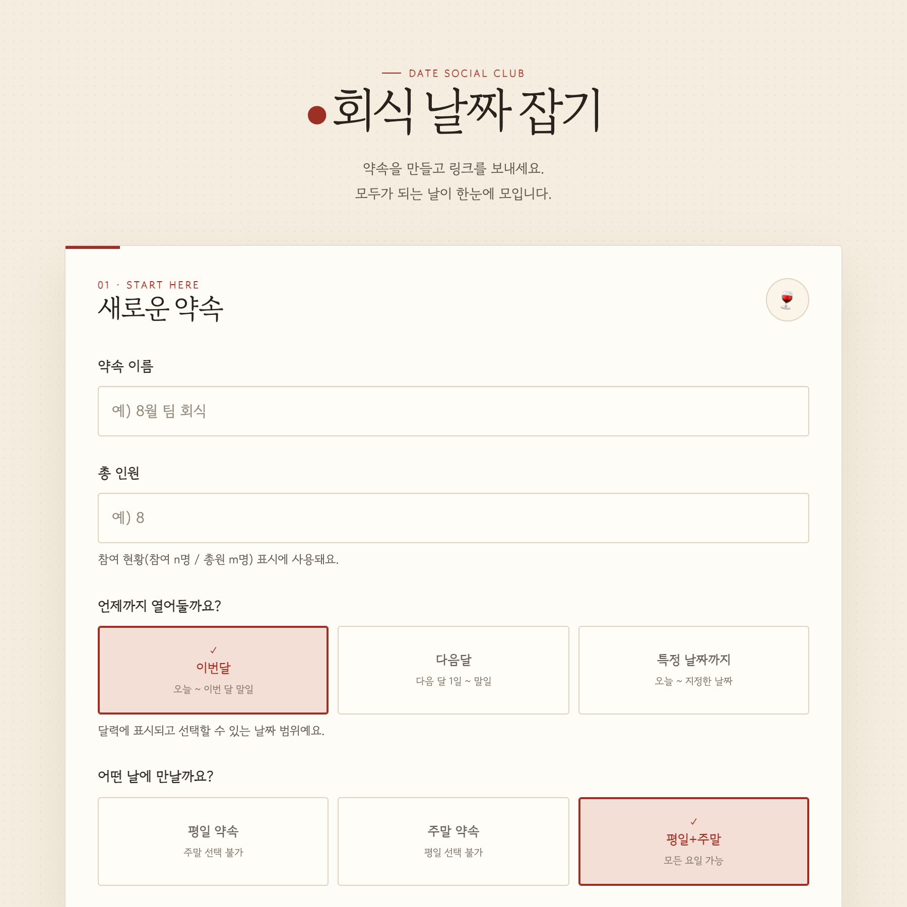
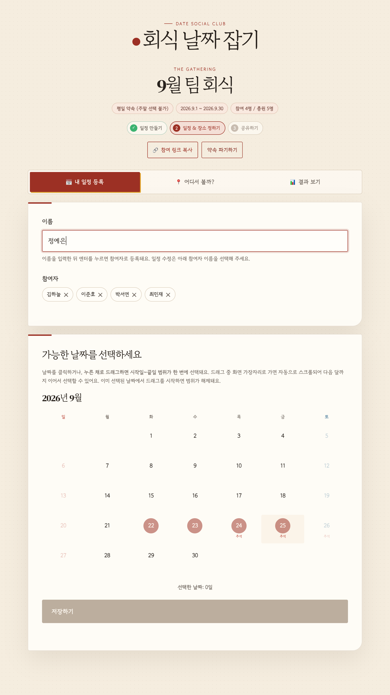
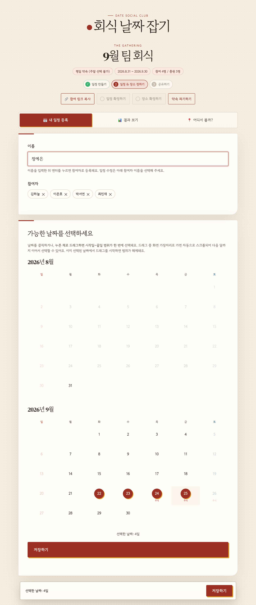
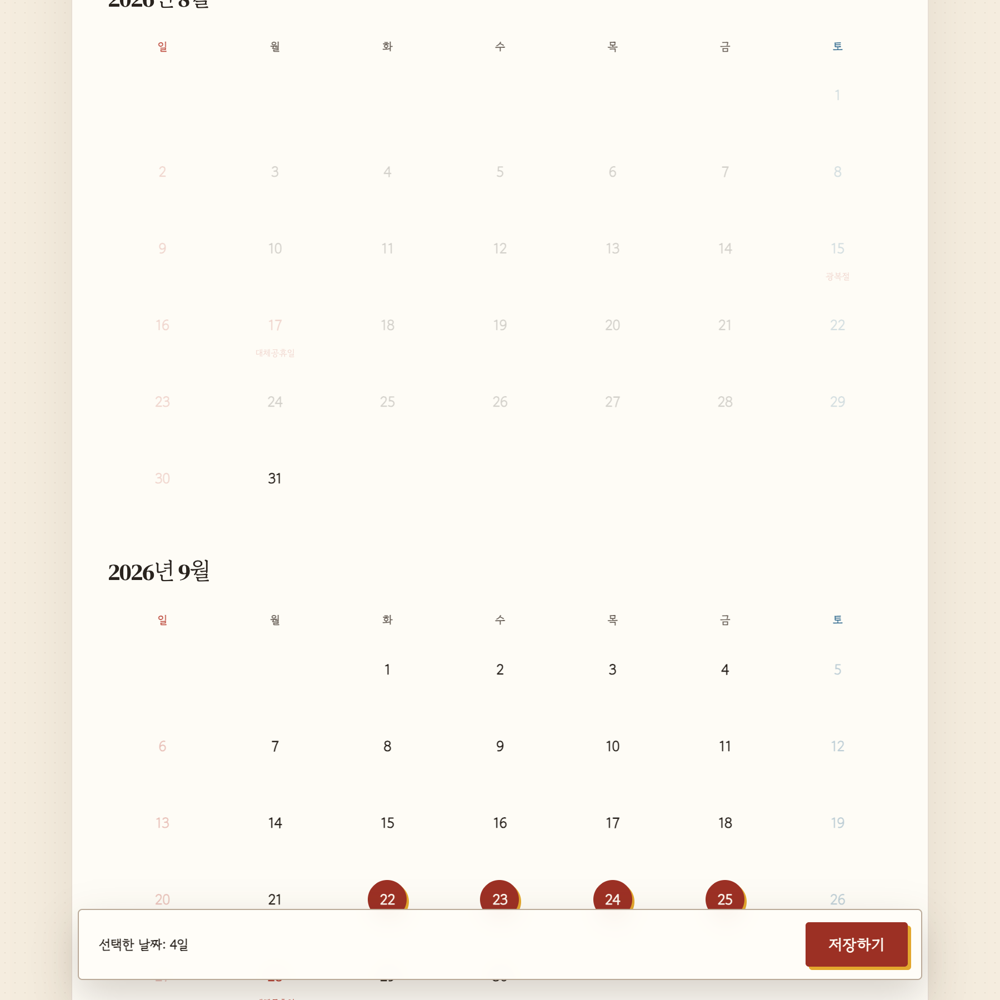
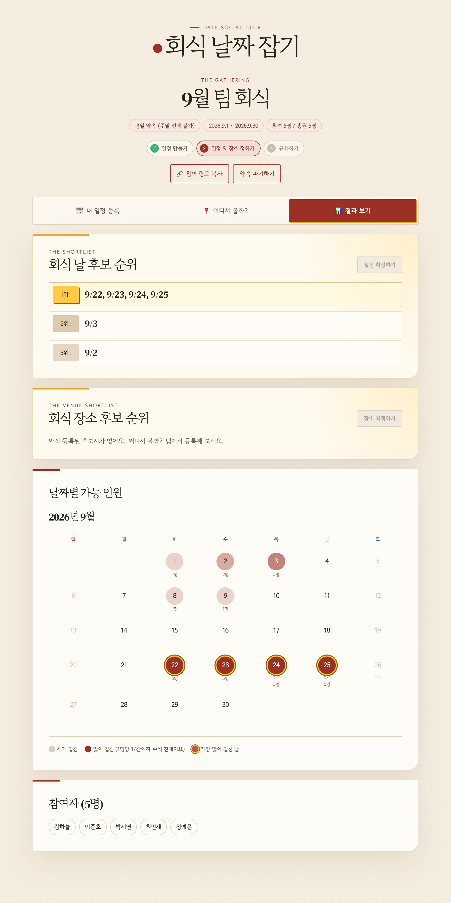
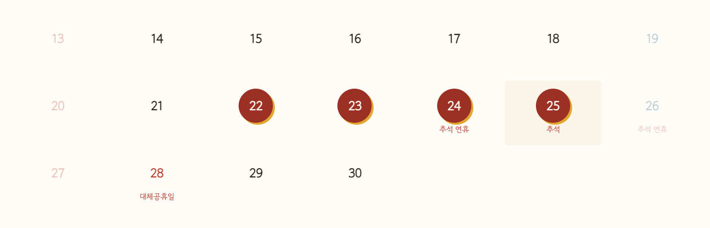
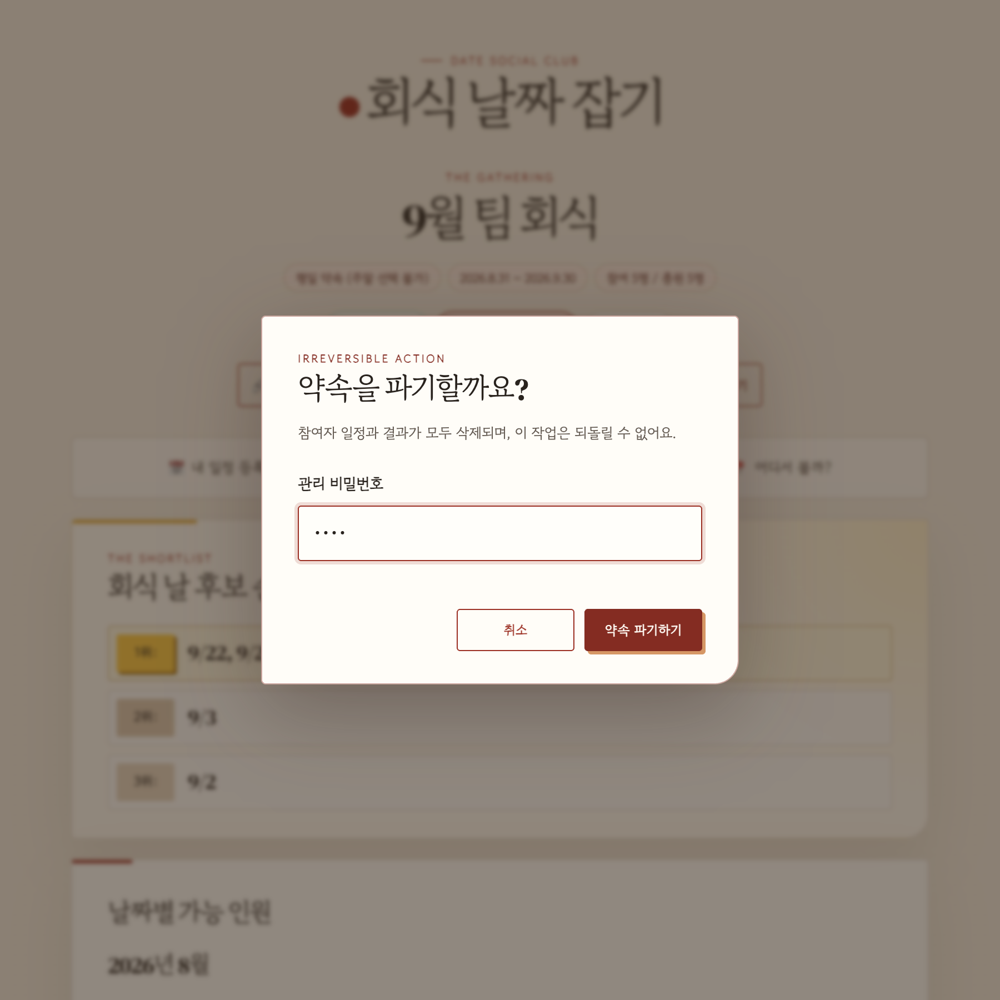

# 🍷 회식 날짜 잡기 (team-dinner-maker)

매달 팀 회식 날짜를 잡기 위한 간단한 웹 페이지입니다.
[언제볼래.kr](https://xn--hj2b65hwxi7pc.kr/)을 모티브로 하되, 실제 사용하며 불편했던 부분을 개선했습니다.

로그인 없이 다음 3단계로 동작합니다. 진행 상황은 약속 페이지 상단의 단계 표시로 확인할 수 있습니다.

1. **일정 만들기** — 약속을 만들고 참여 링크를 공유
2. **일정 & 장소 정하기** — 날짜 투표와 '어디서 볼까?'의 후보지 등록·투표를 **병행**하고, 모임 주최자가 **결과 보기 탭의 각 순위 카드 우상단 버튼**으로 **일정 확정**(날짜·시간)과 **장소 확정**을 각각 켭니다
3. **공유하기** — 마지막 확정이 끝나는 순간 **공유 다이얼로그가 자동으로 열리고**, 이후에는 상단 단계 표시의 **3 공유하기 배지**를 눌러 언제든 다시 엽니다

## 디자인

크림 페이퍼 질감 위에 에스프레소 텍스트와 와인 레드 포인트를 사용한 `DATE SOCIAL CLUB` 테마입니다.
달력의 최다 겹침 날짜는 골드 링과 우상단·좌하단을 번갈아 반짝이는 4방향 스파클로 강조합니다.
결과 탭 상단에는 골드 메달 톤의 후보 순위표를 두어, 달력을 보기 전에 가장 유력한 회식 날짜를 빠르게 비교할 수 있습니다.

## 주요 기능

| 기능 | 설명 |
| --- | --- |
| 수직 스크롤 달력 | 약속의 표시 범위에 포함된 **모든 달이 하나의 달력으로 아래로 이어져** 한 번에 보입니다. (달 넘김 버튼 없음) |
| 드래그 범위 선택 | 달력에서 시작일을 누른 채 드래그하면 **시작일~끝일 사이의 모든 날짜**가 한 번에 선택됩니다. 드래그 중 화면 가장자리로 가면 자동 스크롤되어 **달 경계를 넘어 연속으로** 선택할 수 있습니다. |
| 표시 범위 지정 | 약속을 만들 때 달력 범위를 **이번달(오늘~말일) / 다음달(1일~말일) / 특정 날짜까지(오늘~지정일)** 중에서 지정합니다. |
| 약속 테마 | **평일 약속 / 주말 약속 / 평일+주말** 중 선택. 평일 약속이면 주말이, 주말 약속이면 평일이 자동으로 선택 불가 처리됩니다. |
| 공휴일 표시 | [hudy.co.kr](https://www.hudy.co.kr) 공휴일 API를 **최초 1회만 호출해 현재+미래 5개년(6개 연도)을 캐시에 저장**하고(D1 `holiday_cache` / 로컬 `.data/holidays-cache.json`), 약속을 만들 땐 캐시에서 표시 범위의 공휴일을 꺼내 기입합니다. 캐시가 없으면 내장 데이터(2025~2027)로 폴백합니다. |
| 겹침 농도 뱃지 | 날짜별로 가능한 인원이 많을수록 와인 레드 `#9C3024` 뱃지가 진해집니다. **1명이 선택할 때마다 알파값이 (1/참여자 수)씩** 더해져 전원이 겹친 날은 완전히 진하게 표시됩니다. |
| 최다 겹침 강조 | 가장 많은 인원이 겹친 날(공동 1등 포함)은 딥 골드 테두리의 골드 링과 4방향 스파클로 강조됩니다. 스파클은 우상단·좌하단 순서로 반복 재생됩니다. |
| 회식 날 후보 순위 | 결과 탭 상단에서 가능 인원이 많은 순으로 1~3위 후보를 보여줍니다. 동점 날짜는 같은 순위에 묶어 `1위: 1/1, 1/2` 형식으로 표시합니다. **일정이 확정되면 이 카드가 초록 '확정된 일정' 카드로 전환**되어 확정 날짜·시간을 보여줍니다. |
| 회식 장소 후보 순위 | 결과 탭의 날짜 순위 카드 아래에서 **좋아요(투표) 상위 5곳**을 보여주고, 후보가 더 많으면 **전체 후보 보기** 버튼으로 전체 순위 팝업을 엽니다. **각 후보 행을 누르면 지도가 새 창으로** 열립니다(공유 링크가 있으면 그 링크, 없으면 네이버 지도 검색). **장소가 확정되면 초록 '확정된 장소' 카드로 전환**되어 이름·주소·지도 링크를 보여줍니다. |
| 참여 정원 관리 | 참여자가 총원에 도달하면 새 이름 입력을 비활성화하고, API도 총원 초과 등록을 거부합니다. |
| 일정 등록·수정 | 이름을 입력하고 Enter를 누르면 참여자로 등록되면서 **자동으로 선택되고 날짜 달력이 열립니다**. 달력은 참여자가 선택된 동안에만 보이며, 선택된 칩을 다시 누르면 해제(달력 숨김)됩니다. 기존 일정은 참여자 칩을 눌러 수정하고 ✕로 삭제합니다. |
| 실시간 동기화 | 페이지를 열어두면 다른 참여자의 등록·투표·장소 추가·확정이 **10초 이내에 자동 반영**됩니다(탭이 다시 보이면 즉시 갱신, 변경이 있을 때만 다시 그림). 입력 중인 달력 선택·검색어는 보존됩니다. D1에는 변경 푸시 채널이 없어 SSE 대신 변경 감지 폴링으로 구현했습니다. |
| 관리 비밀번호 | 약속을 만들 때 **숫자 4~6자리 관리 비밀번호**를 정합니다. **일정·장소 확정과 그 취소, 약속 파기**에 사용하며, 서버에는 약속별 랜덤 salt를 붙인 **SHA-256 해시로만 저장**되고 조회 API 응답에서도 제외됩니다. |
| 공유하기 | **일정·장소가 모두 확정되는 순간 공유 다이얼로그가 자동으로 열리고**, 이후엔 상단 **3 공유하기 배지**로 다시 엽니다. **다른 앱으로 일정 공유하기** 한 줄에 **카카오톡 공유**(친구/채팅방 선택, 키 없으면 모바일 공유 시트·문구 복사 폴백)와 **팀즈로 공유**(Teams 공유 창에서 채널·채팅 선택) 버튼이 나란히 있고, **자동 게시(고급)** 는 웹후크 URL로 확정 카드를 자동 게시합니다. 서버도 미확정 상태의 공유 요청은 `409`로 거부합니다. |
| 링크 미리보기 | `/m/:id` 응답에 약속별 **OG 메타태그**(제목·참여 현황·날짜 1위·장소 1위)를 주입해, Teams를 비롯한 메신저에서 링크가 **내용 있는 카드**로 펼쳐집니다. |
| 일정 확정 | 결과 보기 탭 **'회식 날 후보 순위' 카드 우상단의 일정 확정하기 토글**(OFF→ON)에서 **만나는 날짜**(1위 후보 날짜만 선택 가능)와 **시간**, 관리 비밀번호를 입력합니다. ON 상태에서 다시 누르면(**일정 다시 정하기**) 확정이 풀립니다. 장소 확정과는 **독립**이라 서로 영향을 주지 않고, 날짜·시간 값은 보존되어 재확정 때 채워집니다. |
| 장소 확정 | **일정 확정 전에도** '어디서 볼까?'에서 후보지 등록·투표·확정이 가능합니다(병행). 후보지 카드의 **이 곳으로 확정하기** 또는 결과 보기 탭 **'회식 장소 후보 순위' 카드 우상단의 장소 확정하기 토글**(득표순 후보 선택)로 정하고, **장소 공유 링크(선택)** — 네이버지도·카카오맵·구글 지도 등 지도 앱의 공유 링크 — 를 넣으면 일정을 공유할 때 정확한 POI 링크가 실립니다. ON 상태에서 다시 누르면(**장소 다시 정하기**) 확정이 풀리고, 확정된 후보지를 삭제해도 풀립니다. |
| 어디서 볼까? | 네이버 지도 위에 후보지를 핀으로 보여 줍니다. 득표 1위 후보는 목록 카드와 지도 핀이 **함께 골드로 강조**되고, 핀을 누르면 해당 카드로 이동합니다. |
| 후보지 등록 | 장소 이름을 검색하면 **네이버 지역검색**으로 최대 5곳을 찾아 이름·분류·주소·좌표를 자동 입력합니다. `naver.me` POI 링크를 함께 넣으면 후보 카드에서 그 링크로 열리고, 비워두면 이름과 주소로 지도 검색 링크를 만들어 둡니다. (약속당 최대 12곳) |
| 후보지 투표 | 참여자 이름을 고른 뒤 ♡를 눌러 투표합니다. 다시 누르면 취소되고, 목록은 **득표순**으로 정렬됩니다. 선택한 이름은 브라우저에 기억되며, 참여자가 삭제되면 그 사람의 투표도 함께 정리됩니다. |
| 약속 파기 | 약속 페이지의 **약속 파기하기** 버튼으로 약속과 참여자 일정을 모두 삭제합니다. 관리 비밀번호 확인이 필요하고, **5회 틀리면 3분간 관리 기능(확정·파기)이 잠깁니다.** |
| 자동 만료 | 1위 후보 날짜가 지나면 약속이 저장소에서 자동으로 삭제됩니다. 일정이 등록·수정·삭제될 때마다 만료일이 다시 계산됩니다. |

> 원본 서비스의 자주 묻는 질문, footer(개발자 정보/문의 연락처), 점심·저녁 시간 선택 기능은 SPEC에 따라 의도적으로 제외했습니다.

## 실행 방법

### 로컬 실행

Node.js만 있으면 됩니다. (외부 의존성 없음)

```bash
node server.js
# 회식 날짜 잡기 서버 실행 중: http://localhost:8788
```

브라우저에서 `http://localhost:8788` 접속. 데이터는 `.data/` 디렉토리에 약속별 JSON 파일로 저장됩니다.
포트를 바꾸려면 `PORT=3000 node server.js` 처럼 실행하세요.

지도와 장소 검색을 쓰려면 프로젝트 루트에 `NAVER.env`(git에 커밋되지 않음)를 만들어 두세요.
없어도 서버는 뜨지만 '어디서 볼까?' 화면에서 지도와 검색이 비활성화됩니다.

```bash
# NAVER.env
NAVER_MAP_KEY_ID=<NCP Maps 인증 Key ID>       # 브라우저에 노출됨 (서비스 URL로 보호)
NAVER_SEARCH_KEY_ID=<Naver API Hub Client ID>  # 서버 전용
NAVER_SEARCH_KEY=<Naver API Hub Client Secret> # 서버 전용
```

### 네이버 API 키 발급

둘 다 [네이버 클라우드 플랫폼(NCP)](https://www.ncloud.com/) 콘솔 한 곳에서 발급합니다.

| 용도 | 서비스 | 발급 값 | 비고 |
| --- | --- | --- | --- |
| 지도 표시 | **Maps** > Web Dynamic Map | 인증 Key ID | 콘솔의 **서비스 URL**에 `http://localhost:8788`과 배포 도메인을 모두 등록해야 지도가 뜹니다 |
| 장소 검색 | **Naver API Hub** > Search (지역) | Client ID / Client Secret | 서버에서만 호출합니다. 하루 25,000회 한도 |

지도 키는 스크립트 URL에 실려 브라우저로 나가므로 **도메인 제한이 유일한 보호 장치**입니다.
검색 시크릿은 `/api/places/search` 프록시를 통해 서버에서만 쓰이고, 클라이언트로는 사용 가능 여부(`placeSearchEnabled`)만 내려갑니다.

### Cloudflare Pages 배포

**배포 주소: https://team-dinner-maker.pages.dev**

API는 `functions/` 디렉토리의 Pages Functions로 동일하게 구현되어 있으며,
데이터는 **Cloudflare D1**(`team-dinner-maker-db`)의 `events` 테이블에 약속별 JSON으로 저장됩니다.
D1 바인딩(`DB`)은 `wrangler.toml`에 정의되어 있어 배포 시 자동으로 적용됩니다.

```bash
# 재배포 (API 토큰은 CLOUDFLARE.env 참고)
CLOUDFLARE_API_TOKEN=... CLOUDFLARE_ACCOUNT_ID=... \
  npx wrangler pages deploy public --project-name=team-dinner-maker --branch=main
```

네이버 키는 코드에 넣지 말고 Pages 프로젝트의 환경변수/시크릿으로 등록합니다. (한 번만)

```bash
npx wrangler pages secret put NAVER_MAP_KEY_ID    --project-name=team-dinner-maker
npx wrangler pages secret put NAVER_SEARCH_KEY_ID --project-name=team-dinner-maker
npx wrangler pages secret put NAVER_SEARCH_KEY    --project-name=team-dinner-maker
```

`npx wrangler pages dev public`으로 로컬에서 Functions를 테스트할 때는 같은 값을 `.dev.vars`에 적어 두면 됩니다. (역시 git에 커밋되지 않습니다.)

처음부터 다시 구축하는 경우:

```bash
# 1. D1 데이터베이스 생성 후, 출력된 uuid를 wrangler.toml의 database_id에 입력
npx wrangler d1 create team-dinner-maker-db

# 2. 테이블 생성
npx wrangler d1 execute team-dinner-maker-db --remote \
  --command "CREATE TABLE IF NOT EXISTS events (id TEXT PRIMARY KEY, data TEXT NOT NULL)"

# 3. 배포
npx wrangler pages deploy public --project-name=team-dinner-maker --branch=main
```

로컬에서 Pages Functions를 테스트하려면 `npx wrangler pages dev public`을 사용합니다.

### 만료 약속 정리 Worker 배포

Pages Functions는 Cron Trigger를 지원하지 않으므로, 만료된 약속 삭제는 같은 D1을 바인딩한
별도 Worker(`team-dinner-maker-expiry`)가 처리합니다. Pages와 **따로 한 번 배포**해 두면 됩니다.

```bash
npx wrangler deploy --config wrangler.expiry.toml   # npm run expiry:deploy
```

Cron은 UTC 기준이라 `wrangler.expiry.toml`의 `0 15 * * *`가 한국 시간 00:00입니다.
로컬에서 스케줄 동작을 확인하려면 `npm run expiry:dev`로 띄운 뒤 `/cdn-cgi/handler/scheduled`를 호출하세요.

---

# 사용 가이드

## 1. 약속 만들기

첫 화면에서 약속 정보를 입력하고 **약속 만들기**를 누릅니다.

- **약속 이름** : 참여자에게 보여줄 이름 (예: 9월 팀 회식)
- **총 인원** : 팀 전체 인원수입니다. 약속 페이지의 참여 현황(참여 n명 / 총원 m명)에 표시되며, 참여자가 총원에 도달하면 새 참여자를 더 등록할 수 없습니다.
- **표시 범위** : 달력에 표시되고 선택할 수 있는 날짜 범위입니다.
  - **이번달** : 오늘 ~ 이번 달 말일
  - **다음달** : 다음 달 1일 ~ 말일
  - **특정 날짜까지** : 오늘 ~ 직접 지정한 날짜 (선택 시 날짜 입력칸이 나타납니다. 최대 1년)
- **약속 테마** : 평일 약속 / 주말 약속 / 평일+주말 중 선택. 테마에 따라 달력에서 선택할 수 없는 요일이 자동으로 비활성화됩니다.
- **관리 비밀번호** : 나중에 약속을 파기할 때 필요한 **숫자 4~6자리** 비밀번호입니다. 필수 입력이며, 입력하는 동안 아래 힌트에 형식이 맞는지(`OK` / 안내 문구) 바로 표시됩니다.
  **잊으면 복구할 수 없으니** 약속을 만든 사람이 따로 보관해 두세요. (약속을 파기할 때만 쓰이고, 참여·결과 보기에는 필요하지 않습니다.)

아래는 총 인원 5명, 관리 비밀번호 4자리, 표시 범위 **특정 날짜까지**(2026-09-30), 테마 **평일 약속**으로 입력한 화면입니다.
관리 비밀번호는 형식이 맞으면 입력칸 아래에 `OK`가 표시되고, 표시 범위를 "특정 날짜까지"로 고르면 날짜 입력칸이 나타납니다.



만들기가 끝나면 약속 페이지(`/m/<약속ID>`)로 이동합니다.
참여 링크는 ID가 쿼리스트링으로 노출되는 형태가 아니라 `https://.../m/88389d` 같은 짧은 경로 형태입니다.
(예전 형식인 `/event.html?id=...`로 들어와도 자동으로 `/m/<약속ID>`로 정리됩니다.)

## 2. 링크 공유하기

약속 페이지 상단의 **🔗 참여 링크 복사** 버튼을 누르면 현재 페이지 주소가 클립보드에 복사됩니다.
이 링크를 팀 채팅방 등에 공유하면 누구나 로그인 없이 바로 참여할 수 있습니다.

### 카카오톡·팀즈로 공유하기

공유는 **일정과 장소가 모두 확정된 뒤에만** 할 수 있습니다.
마지막 확정이 끝나는 순간 **공유 다이얼로그가 자동으로 열리고**, 이후에는 상단 단계 표시의 **3 공유하기 배지**를 눌러 언제든 다시 열 수 있습니다.
(모든 결정이 끝난 다음 공유하는 용도이며, 서버도 미확정 상태의 공유 요청을 `409`로 거부합니다.)
카드에는 후보 순위가 아니라 **확정된 날짜 · 시간 · 장소**가 실립니다.

버튼을 누르면 세 가지 방법이 나옵니다.

#### 방법 0. 카카오톡으로 공유 (준비 불필요)

**카카오톡으로 공유** 버튼은 환경에 따라 가장 좋은 방법을 자동으로 고릅니다.

1. **카카오 JavaScript 키가 설정돼 있으면** — 공식 카카오 공유 창이 열려 친구/채팅방을 골라 보냅니다.
2. **키가 없고 모바일이면** — OS 공유 시트가 열리고 목록에서 카카오톡을 선택합니다.
3. **키가 없고 데스크톱이면** — 공유 문구가 클립보드에 복사되고, 카카오톡에 붙여넣으면 됩니다.

공식 공유 창(1번)을 쓰려면 [developers.kakao.com](https://developers.kakao.com)에서 앱을 만들어
**JavaScript 키**를 `KAKAO.env`(로컬) / `.dev.vars` / Pages 시크릿 `KAKAO_JS_KEY`(배포)에 넣고,
카카오 콘솔의 **[플랫폼 키] > [JavaScript SDK 도메인]** 에 `http://localhost:8788` 과 배포 도메인을 등록하세요.
이 키는 브라우저에 노출되는 값이라 도메인 등록이 보호 장치입니다. 키가 없어도 2·3번 폴백으로 동작합니다.

#### 방법 1. 채널 골라서 보내기 (준비 불필요)

**Teams로 공유** 버튼을 누르면 Teams 공유 창이 열립니다. 거기서 **채널이나 채팅을 직접 고르고** [공유]를 누르면 끝입니다.
받는 채널에는 약속 링크가 카드로 펼쳐지고, compose box에는 요약 문구가 미리 채워집니다.

- **사전 설정이 전혀 없습니다.** 워크플로도, 웹후크도, 로그인도 필요 없습니다.
- 마이크로소프트 제약: **데스크톱 Chrome·Edge에서만** 동작하고, 게스트·Freemium 계정은 지원되지 않습니다. 모바일에서는 참여 링크를 복사해 붙여넣어 주세요.
- 미리 채워지는 문구는 모임 이름·날짜/시간·모이는 곳·장소 공유 링크(있을 때)·인원·웹 링크의 줄 단위 포맷이며, 마이크로소프트 사양상 **200자까지**라 상세 내용은 링크 카드가 대신 보여줍니다.
- 마지막에 사용자가 [공유]를 눌러야 전송됩니다. (자동 전송 아님)

> 링크 카드는 `/m/:id` 응답에 주입되는 OG 메타태그로 만들어집니다.
> 서버가 약속을 조회해 **제목 · 참여 현황 · 만나는 시간 · 날짜 1위 · 장소 1위**를 채워 넣으므로, 링크만 붙여넣어도 내용이 보입니다.
> (Cloudflare는 `functions/m/[id].js`의 `HTMLRewriter`, 로컬은 `server.js`가 같은 태그를 넣습니다.)

#### 방법 2. 자동 게시 (고급)

사람이 누르지 않아도 채널에 카드가 올라갑니다. 대신 **채널마다 한 번** 워크플로를 만들어야 합니다.

1. Teams에서 올릴 **채널 › ⋯ › 워크플로**를 엽니다.
2. **"웹후크 요청이 수신되면 채널에 게시"** 템플릿을 만듭니다.
3. 생성된 **HTTP POST URL**을 복사해 다이얼로그에 붙여넣고 **채널로 자동 게시**를 누릅니다.

> **401 오류가 나면**: 워크플로 트리거의 **"흐름을 트리거할 수 있는 사용자"** 가 '내 테넌트의 사용자'로 제한된 경우가 대부분입니다.
> [make.powerautomate.com](https://make.powerautomate.com) → 내 흐름 → 해당 워크플로 **편집** → 첫 단계(웹후크 요청이 수신되면) 클릭 →
> **흐름을 트리거할 수 있는 사용자**를 **"모든 사용자"(Anyone)** 로 바꾸고 저장하세요. (URL은 그대로 다시 쓰면 됩니다.)
> 그래도 안 되면 URL이 `&sig=...`까지 끝까지 복사됐는지 확인하세요. 실제 거부 사유는 서버 로그(`[teams-export]`)에 남습니다.

카드에는 **확정된 날짜 / 시간 / 장소 이름·주소 / 장소 공유 링크(있을 때) / 참여 인원**이 담기고,
**지도에서 보기**(장소 확정 때 링크를 넣은 경우) / **약속 페이지 열기** 버튼이 붙습니다. 한 줄 메모를 적으면 카드 상단에 표시됩니다.

웹후크 본문에는 워크플로에서 바로 꺼내 쓸 수 있도록 확정 정보가 **최상위 필드**로 함께 실립니다.

```jsonc
{
  "date": "2026-09-12",           // 확정 날짜 (yyyy-MM-dd)
  "time": "17:30",                // 확정 시간 (24시간제 HH:mm)
  "poi_name": "뮌헨호프",           // 확정 장소 이름
  "address": "서울특별시 중구 …",     // 확정 장소 주소 (도로명 우선)
  "web_link": "https://…/m/abc123", // 모임(약속) 페이지 링크
  "url": "https://naver.me/…",    // 장소 공유 링크(네이버지도·카카오맵·구글 지도) — 장소 확정 때 넣은 경우에만 포함
  "type": "message",              // 이하는 기본 워크플로 템플릿이 그대로 렌더하는 Adaptive Card
  "attachments": [ … ]
}
```

`url` 은 **사용자가 붙여넣은 링크가 있을 때만** 포함됩니다. 검색 URL을 실제 POI 링크처럼 보내지 않기 위해, 링크가 없으면 필드 자체를 뺍니다.

> **URL은 서버에 저장되지 않습니다.** 웹후크 URL 자체가 "그 채널에 글을 쓸 수 있는 권한"이라 서버에는 두지 않습니다.
> 대신 한 번 보내면 **이 브라우저(localStorage)에만 기억**해 다음부터 자동으로 채워집니다.
> 다른 사람·다른 기기에는 보이지 않으며, **저장된 URL 지우기**로 언제든 잊게 할 수 있습니다.
> (형식이 틀려 거부된 URL은 기억하지 않습니다.)

보안·오남용 방지를 위해 다음이 적용됩니다.

- **호스트 화이트리스트**: `logic.azure.com`, `environment.api.powerplatform.com`, `webhook.office.com`(및 하위 도메인)만 허용하고 **https만** 받습니다. 서버가 임의 주소로 요청을 보내는 SSRF를 막기 위한 것으로, `https://logic.azure.com.공격자도메인/` 같은 접미사 위장도 거부됩니다.
- **리다이렉트 미추적**: 웹후크 응답이 리다이렉트면 따라가지 않고 실패 처리합니다. (화이트리스트 우회 차단)
- **카드 내용은 서버가 생성**: 클라이언트가 보낸 임의 문구를 그대로 채널에 올리지 않고, 저장된 약속 데이터로 카드를 만듭니다. 메모만 따로 받아 제어문자를 제거하고 200자로 자릅니다.
- **쿨다운 10초**: 같은 약속이 연달아 채널에 도배되지 않도록 제한합니다.
- 실패 시 웹후크의 응답 본문은 그대로 돌려주지 않고 상태 코드만 안내합니다.

#### 왜 "채널 링크만 넣으면 전송"은 안 되나

Microsoft Graph로 채널에 글을 쓰려면 위임 권한 `ChannelMessage.Send`(= **로그인 필요**)가 있어야 하고,
앱 전용 권한은 마이그레이션용 `Teamwork.Migrate.All` 하나뿐이라 쓸 수 없습니다.
딥링크도 채널에는 본문 미리채움 파라미터가 없고, 유일하게 채워지는 `l/chat/0/0?message=` 조차 사용자가 직접 Enter를 눌러야 합니다.
**링크는 주소일 뿐 권한이 없고, 웹후크 URL은 그 자체가 권한**(`&sig=` SAS 서명)이라 두 방법의 성격이 다릅니다.
그래서 "설정 없는 방법 1"과 "자동화되는 방법 2"를 함께 제공합니다.

## 3. 내 일정 등록하기

**📅 내 일정 등록** 탭에서 새 참여자 이름을 입력하거나, 참여자 목록에서 일정을 바꿀 사람의 이름 칩을 선택한 뒤 달력에서 가능한 날짜를 선택합니다.

- **새 참여자** : 이름을 입력하면 달력 선택이 활성화됩니다. 날짜를 고른 뒤 **저장하기**를 누르면 일정과 함께 등록됩니다.
- **이름만 먼저 등록** : 이름 입력란에서 **Enter**를 누르면 날짜 없이 참여자로 등록되고 입력칸은 바로 비워집니다.
- **기존 일정 수정** : 참여자 이름 칩을 선택하면 해당 사람의 날짜가 활성화됩니다. 이때 이름은 입력칸에 자동으로 채워지지 않습니다.
- **총원 도달 후** : 새 이름 입력은 비활성화됩니다. 이미 등록된 참여자의 칩을 선택해 일정만 수정할 수 있습니다.

달력은 언제볼래.kr처럼 **표시 범위의 모든 달이 아래로 이어지는 수직 스크롤 형태**라서
달 넘김 버튼 없이 전체 범위를 스크롤로 훑어볼 수 있습니다.

날짜 선택 방법:

- **클릭** : 날짜 하나를 선택/해제합니다.
- **드래그** : 시작일을 누른 채 끝일까지 드래그하면 **그 사이의 모든 날짜가 범위로 한 번에 선택**됩니다.
- **드래그 + 스크롤** : 드래그 중 화면 위/아래 가장자리로 포인터를 가져가면 자동으로 스크롤되고,
  휠 스크롤도 그대로 동작하므로 **달 경계를 넘어 연속된 범위**를 끊김 없이 선택할 수 있습니다.
- **드래그 해제** : 이미 선택된 날짜에서 드래그를 시작하면 지나간 범위가 한 번에 해제됩니다.

아래는 2026년 9월 22일에서 25일까지 **드래그로 범위를 미리보는 중**의 화면입니다.
범위 미리보기가 연한 와인 레드로 표시되고, 테마가 "평일 약속"이라 주말은 흐리게 비활성화되어
범위에서 자동으로 제외됩니다. 달력 날짜 아래에 공휴일(추석 연휴, 대체공휴일 등)이 표시된 것도 볼 수 있습니다.



드래그를 놓으면 범위 안의 선택 가능한 날짜가 모두 선택되고, 하단에 선택한 날짜 수가 표시됩니다.



**저장하기**를 누르면 일정이 등록되고 결과 화면으로 이동하며, 다음 사람이 이어서 등록할 수 있도록
이름 입력란과 날짜 선택이 자동으로 초기화됩니다.
저장하기 버튼은 **날짜를 1일 이상 선택해야 활성화**됩니다.
날짜 선택 없이 이름만 먼저 등록하고 싶다면 이름 입력란에서 **엔터**를 치세요. 참여자로 바로 등록된 뒤
입력칸은 비워지고, 참여자 칩을 선택해야 그 사람의 날짜를 등록·수정할 수 있습니다.

달력이 길어서 저장하기 버튼이 화면 밖에 있을 때는 **하단에 플로팅 저장 바**가 나타나
스크롤 위치와 상관없이 언제든 저장할 수 있습니다.
아래 화면처럼 표시 범위가 여러 달에 걸치면 달력이 세로로 이어지고, 범위 밖의 날짜(8/1~8/26)는 흐리게 표시됩니다.



일정을 수정하려면 참여자 목록에서 자기 이름 칩을 클릭해 기존 선택을 활성화한 뒤 날짜를 고쳐서 다시 저장하면 됩니다.
이미 등록된 이름을 직접 입력해 저장하는 방식은 일정 덮어쓰기를 막기 위해 지원하지 않습니다. 칩의 ✕ 버튼으로 참여자를 삭제할 수도 있습니다.

## 4. 결과 보기


**📊 결과 보기** 탭에서 날짜별로 몇 명이 가능한지 확인합니다.

- 탭 바 바로 아래의 **회식 날 후보 순위** 카드에서 가능 인원이 많은 날짜를 1위부터 3위까지 먼저 확인할 수 있습니다.
  같은 가능 인원수의 날짜는 한 순위로 묶어 `1위: 9/22, 9/23, 9/24, 9/25`처럼 표시합니다. 아직 일정이 없으면 빈 상태 안내가 표시됩니다.
- 그 아래 **회식 장소 후보 순위** 카드에서 '어디서 볼까?'에 모인 후보지를 **좋아요(투표) 순 상위 5곳**까지 보여줍니다(동점은 같은 순위).
  후보가 5곳을 넘으면 카드 우하단의 **전체 후보 보기** 버튼으로 전체 순위 팝업을 열 수 있습니다.
- **확정되면 카드가 전환됩니다** — 일정이 확정되면 날짜 카드가 초록 **확정된 일정**(날짜·시간) 카드로,
  장소가 확정되면 장소 카드가 초록 **확정된 장소**(이름·주소·지도 링크) 카드로 바뀝니다.
  일정·장소는 독립이라 넷 중 어떤 조합(후보/후보, 확정/후보, 후보/확정, 확정/확정)도 그대로 반영됩니다.
- 가능 인원이 있는 날짜는 와인 레드 `#9C3024` 뱃지로 표시되며, **1명이 선택할 때마다 (1/참여자 수)만큼 진해집니다.**
  아래 화면은 참여자 5명 기준으로 1명(연함) ~ 5명(완전히 진함)이 겹친 모습입니다.
- **가장 많이 겹친 날(공동 1등 포함)은 딥 골드 링과 4방향 골드 스파클**로 강조됩니다. 스파클은 뱃지의 우상단과 좌하단에서 번갈아 재생됩니다. (아래에서 5명이 겹친 9/22~9/25)
- 날짜 아래에 가능 인원수(`n명`)가 함께 표시됩니다.
- 결과 달력도 표시 범위 전체(여러 달)가 수직으로 이어져 보이며, 표시 범위 밖의 날짜는 흐리게 표시됩니다.
- 날짜를 클릭하면 그 날 **가능한 사람 / 미응답·불가인 사람** 명단이 아래에 표시됩니다.



## 5. 공휴일 표시

대한민국 법정 공휴일(대체공휴일 포함)은 달력의 해당 날짜 아래에 빨간 텍스트로 표시됩니다.



공휴일은 [hudy.co.kr](https://www.hudy.co.kr) 공휴일 API(`GET /v2/holidays?year=`, 연 단위라 한 콜에 그 해 모든 월이 포함)를
**최초 1회만 호출해 현재+미래 5개년(6개 연도)을 캐시에 저장**해 두고, 약속을 만들 땐 **캐시에서** 표시 범위의 공휴일을 꺼내 약속에 기입합니다.

- **로컬(server.js)**: 서버 구동 시 `.data/holidays-cache.json` 이 없으면 1회 시딩합니다. (있으면 호출 없음)
- **Cloudflare(D1)**: `holiday_cache` 테이블이 비어 있으면 첫 약속 생성 때 1회 시딩합니다. 테이블은 자동 생성됩니다.
- 시딩은 **총 6콜**(연도당 1콜)이고, 이후 약속 생성은 **API 콜 0회**입니다. 무료 플랜 월 100콜 한도에 여유가 큽니다.
- 아직 데이터가 없는 미래 연도(빈 응답)도 저장해 재호출을 막고, **실패한 해만** 다음 기회에 다시 시도합니다.
- 캐시가 전혀 없거나 키가 없으면 약속에는 `holidays: null` 로 저장되고, 화면은 내장 데이터(`public/js/holidays.js`, 2025~2027)로 폴백합니다.
- API 키는 `HUDY.env`(로컬) / `.dev.vars`(wrangler dev) / Pages 시크릿 `HUDY_API_KEY`(배포)에 둡니다. 모두 git에 커밋되지 않고 클라이언트로 나가지 않습니다.
- 캐시를 새로 받고 싶으면(연도가 지났을 때 등) 로컬은 `.data/holidays-cache.json` 삭제 후 재기동, D1은 `DELETE FROM holiday_cache` 후 약속을 하나 만들면 됩니다.

## 6. 일정 & 장소 정하기 (병행)

날짜가 어느 정도 모이면 **어디서 만날지**를 정할 차례입니다.

'어디서 볼까?' 탭은 **항상 열려 있어**, 날짜 투표가 끝나기 전에도 후보지를 모으고 투표할 수 있습니다.
일정과 장소는 **결과 보기 탭의 두 순위 카드 우상단 토글 버튼**으로 각각 확정합니다(카드 제목과 나란히 배치). 누르기 전(OFF)은 와인 레드의 활성 버튼, 확정된 뒤(ON)는 초록으로 채워진 모양이며, 누를 때마다 확정↔다시 정하기가 전환됩니다. 확정·해제하면 보고 있는 순위 카드가 그 자리에서 확정 카드로 전환됩니다. (둘 다 관리 비밀번호 필요)

### 6-1. 일정 확정하기

결과 보기 탭 **'회식 날 후보 순위' 카드 우상단**의 **일정 확정하기** 토글을 누릅니다.

1. **언제 만날까요?** 에서 만나는 날짜를 고릅니다. **가장 많은 인원이 겹친 1위 후보 날짜만** 선택지에 나오며(동점이면 모두), 아직 등록된 일정이 없으면 확정할 수 없습니다.
2. **몇 시에 볼까요?** 에서 만나는 시간을 고릅니다. (기본값 `19:00`, 5분 단위)
3. **관리 비밀번호**(숫자 4~6자리)를 입력합니다.
4. 확정되면 토글이 ON(초록 채움)이 되고 '어디서 볼까?' 화면으로 이동합니다. ON 상태의 라벨은 **일정 다시 정하기**로 바뀝니다.

확정된 시간은 상단에 `🕖 오후 7:00 만남` 칩으로, '어디서 볼까?' 화면 상단에는 `오후 7:00에 만나요` 로 표시됩니다.
팀즈 카드의 **만나는 시간** 항목과 링크 미리보기 설명에도 함께 들어갑니다.

- 날짜는 **1위 후보 날짜인지 서버에서도 검증**하고(`400`), 시간은 **HH:MM(24시간제)** 로 검증합니다. 형식이 틀리면 `400` 이고, **비밀번호보다 먼저 검사하므로** 입력 실수로 잠금 횟수가 깎이지 않습니다.
- 다시 확정하면 날짜·시간을 바꿀 수 있고, 확정 다이얼로그에는 **이전에 정한 값이 채워져** 열립니다.

확정 후에도 참여자는 계속 일정을 등록·수정할 수 있고, 결과 순위도 그대로 갱신됩니다.
**일정 다시 정하기**(확정 풀기)를 해도 장소 확정과 후보지·투표·날짜·시간 값은 그대로 남습니다.

> 확정과 파기는 **같은 잠금 카운터**를 씁니다. 관리 비밀번호를 5회 틀리면 3분간 두 버튼이 모두 잠깁니다.

### 6-2. 후보지 등록하기

**장소 이름 검색**에 상호를 넣고 검색하면 네이버 지역검색이 **최대 5곳**을 돌려줍니다.
(한 번에 5개까지만 오므로, 원하는 곳이 안 보이면 `지역명 + 상호`로 좁혀 주세요.)

원하는 곳을 고르면 **이름 / 분류 / 주소 / 좌표**가 자동으로 채워집니다. **후보로 등록**을 누르면 목록과 지도에 추가됩니다.

**장소 공유 링크 (선택)** 칸에 지도 앱에서 공유한 링크(`https://naver.me/...`, `https://kko.to/...` 등)를 함께 넣으면, 후보 카드의 **지도 ↗** 가 그 링크로 열립니다.
비워두면 이름과 주소로 네이버 지도 검색 링크를 자동으로 만들어 두므로 링크는 필수가 아닙니다.

- 저장되는 링크는 **주요 지도 앱 도메인**(네이버지도 `naver.me`/`naver.com`, 카카오맵 `kko.to`/`kakao.com`, 구글 지도 `maps.app.goo.gl`/`google.com`)만 허용됩니다.
- 좌표가 대한민국 범위를 벗어나면 거부됩니다.
- 같은 장소(이름+도로명주소가 같거나 좌표가 동일)는 중복 등록되지 않습니다.
- 한 약속에 후보지는 **최대 12곳**까지 등록할 수 있습니다.

> 참고: `naver.me` 링크만으로는 장소 이름과 주소를 가져올 수 없습니다. 링크가 열리는 페이지에 장소 정보가 담겨 있지 않기 때문에,
> 이름·주소·좌표는 네이버 지역검색 API로 채웁니다. 그래서 **검색으로 고르고, 링크는 선택 첨부**하는 방식입니다.

### 6-3. 투표하기

1. 화면 위쪽 **나는 누구인가요?** 에서 자기 이름을 고릅니다. (선택한 이름은 브라우저에 기억됩니다)
2. 후보지 카드의 **♡** 를 누르면 투표되고, 다시 누르면 취소됩니다.
3. 목록은 **득표순**으로 정렬되고, 1위 후보는 카드와 지도 핀이 함께 골드로 강조됩니다.

지도의 핀을 누르면 해당 후보 카드로 스크롤되어 잠깐 강조됩니다.
참여자를 삭제하면 그 사람이 넣은 투표도 함께 정리됩니다.

후보 카드와 검색 결과의 **지도 ↗** 는 붙여넣은 POI 링크가 있으면 그 링크로, 없으면 **이름 + 시군구** 검색으로 연결됩니다.
(전체 도로명주소로 검색하면 네이버 지도에서 결과가 나오지 않아 시군구까지만 사용합니다.)

### 6-4. 장소 확정하기

투표가 모이면 후보 카드 아래의 **이 곳으로 확정하기** 버튼으로 최종 장소를 정합니다.
상단의 **장소 확정하기** 토글로도 정할 수 있어요 — 이때는 **득표순 후보 목록**에서 고릅니다. (일정 확정 전에도 가능)

1. **장소 공유 링크 (선택)** — 네이버지도·카카오맵·구글 지도 등 지도 앱의 공유 링크를 넣어두면 일정을 공유할 때 **정확한 POI 링크**가 함께 전달됩니다. 비우면 링크 없이 보냅니다.
2. **관리 비밀번호**를 입력하면 확정됩니다.

확정된 장소는 카드가 초록색으로 강조되고, '어디서 볼까?' 상단에 **확정된 장소** 배너가 나타납니다. **일정도 확정되어 있으면** 곧바로 공유 다이얼로그가 열립니다(공유 단계).
확정된 카드를 다시 누르면 확정이 취소되고, 확정된 후보지를 삭제해도 확정이 함께 풀립니다.

> 지도 키가 없거나 NCP 콘솔에 현재 도메인이 등록되지 않으면 지도 자리에 안내 문구가 뜨고,
> **후보지 목록과 투표는 그대로 동작**합니다.

## 7. 약속 파기하기

회식이 취소되거나 잘못 만든 약속을 정리하려면 약속 페이지 상단의 **약속 파기하기** 버튼을 누릅니다.

1. 확인 창이 열리고, 참여자 일정과 결과가 모두 삭제되며 되돌릴 수 없다는 안내가 표시됩니다.
2. 약속을 만들 때 정한 **관리 비밀번호**(숫자 4~6자리)를 입력합니다.
3. **약속 파기하기**를 누르면 약속이 삭제되고, 완료 안내 후 첫 화면으로 돌아갑니다.



주의할 점:

- **되돌릴 수 없습니다.** 약속 자체와 참여자 일정이 저장소에서 완전히 삭제되며, 기존 참여 링크는 "약속을 찾을 수 없습니다" 화면이 됩니다.
- 참여자 누구나 버튼을 누를 수는 있지만, **관리 비밀번호를 아는 사람만** 실제로 파기할 수 있습니다.
- **비밀번호를 5회 틀리면 그 약속의 관리 기능(일정 확정·확정 취소·파기)이 3분간 잠깁니다.** 잠긴 동안에는 두 버튼과 입력칸이 비활성화되고 남은 잠금 안내가 표시됩니다. (3분이 지나면 자동으로 해제됩니다.)
- 관리 비밀번호 기능이 추가되기 전에 만든 약속은 파기·확정할 수 없습니다. (`409` 응답)
- 참여자 한 명만 빼고 싶을 때는 파기가 아니라 참여자 칩의 **✕** 버튼을 사용하세요.

## 8. 약속 자동 만료

방치된 약속이 계속 쌓이지 않도록, 약속은 **회식 날짜가 지나면 자동으로 삭제**됩니다.

- 만료일은 **1위 후보 날짜의 다음 날**입니다. 공동 1위가 여러 날이면 **가장 늦은 1위 후보의 다음 날**로 잡아, 1위 후보를 모두 지난 뒤에 삭제됩니다.
- 만료일은 참여자 일정이 **등록·수정·삭제될 때마다 다시 계산**됩니다. 따라서 일정이 늘어나 1위 날짜가 바뀌면 만료일도 함께 따라갑니다.
- 아직 등록된 일정이 없는 약속은 만료일이 없어(`null`) 삭제 대상이 아닙니다.
- 실제 삭제는 **매일 한국 시간 자정(00:00)** 에 도는 Cron Worker가 처리합니다. 만료일이 오늘이거나 지난 약속을 D1에서 지웁니다.
- 만료일은 화면에 표시되지 않는 내부 값이며, 조회 API 응답의 `expireDate`로 확인할 수 있습니다.

> 로컬 `server.js`도 같은 규칙으로 `expireDate`를 계산해 저장하지만, 로컬에는 스케줄러가 없어 자동 삭제는 일어나지 않습니다.

---

## 프로젝트 구조

```
├── public/                  # 정적 프론트엔드 (Cloudflare Pages 빌드 출력)
│   ├── index.html           #   약속 만들기 화면
│   ├── event.html           #   약속 페이지 (일정 등록 / 결과 보기 / 어디서 볼까?, /m/<id> 로 접근)
│   ├── _redirects           #   /m/* → 약속 페이지 rewrite (Cloudflare Pages)
│   ├── css/style.css
│   └── js/
│       ├── holidays.js      #   공휴일 폴백 데이터(2025~2027) + 활성 공휴일 전환(getHoliday)
│       ├── calendar.js      #   달력 컴포넌트 (드래그 범위 선택, 테마 제한, 결과 뱃지)
│       ├── place-map.js     #   네이버 지도 로더 + 후보지 핀 렌더러
│       ├── index.js
│       └── event.js
├── functions/               # Cloudflare Pages Functions (D1 저장)
│   ├── m/[id].js            #   /m/:id 에 약속별 OG 메타태그 주입 (링크 미리보기)
│   └── api/
│       ├── _shared.js       #   공용 로직 (밑줄로 시작해 라우트로 노출되지 않음)
│       ├── config.js        #   지도 키 등 공개 설정
│       ├── places/search.js #   네이버 지역검색 프록시
│       └── events/...       #   약속 / 참여자 / 일정·장소 확정 / 후보지 / 팀즈 공유
├── scripts/
│   └── capture-screenshots.mjs  # README 화면 캡처(images/) 재생성 스크립트
├── workers/
│   └── expiry-scheduler.js  # 만료된 약속을 D1에서 지우는 Cron Worker
├── server.js                # 로컬 실행용 무의존성 서버 (.data/에 JSON 파일 저장)
├── NAVER.env                # 네이버 API 키 (git 제외) — 로컬 server.js 가 읽음
├── HUDY.env                 # hudy 공휴일 API 키 (git 제외) — 로컬 server.js 가 읽음
├── .dev.vars                # 네이버 API 키 (git 제외) — wrangler pages dev 가 읽음
├── wrangler.toml            # Cloudflare Pages 설정 (D1 바인딩: DB)
└── wrangler.expiry.toml     # 만료 정리 Worker 설정 (Cron Trigger: 매일 15:00 UTC)
```

## 화면 캡처 갱신

README에 쓰는 `images/*.png`는 스크립트로 다시 뽑을 수 있습니다.

```bash
npm run capture
```

임시 포트(기본 8899)로 로컬 서버를 띄우고, `puppeteer-core`와 **시스템에 설치된 Chrome**으로
실제 화면을 조작해 7개 캡처를 촬영합니다. 끝나면 캡처용으로 만든 약속을 지우고 서버도 종료합니다.
Chrome 경로를 자동으로 못 찾으면 `CHROME_PATH`로 지정하고, 진행 과정을 눈으로 보려면 `HEADFUL=1`을 붙이세요.

UI를 수정했으면 이 스크립트를 다시 돌려 캡처를 맞춰 주세요.
시나리오(총원 5명 / 표시 범위 오늘~2026-09-30 / 평일 약속 / 9월 22~25일 전원 겹침)는
`scripts/capture-screenshots.mjs` 상단 상수에서 바꿀 수 있습니다.

## API

| 메서드 | 경로 | 설명 |
| --- | --- | --- |
| `POST` | `/api/events` | 약속 생성 `{title, totalCount, theme, startDate, endDate, managePin}` → `{id}`. 생성 시 표시 범위의 공휴일을 **캐시에서 조회**해 `holidays` 로 기입(캐시 없으면 `null`) |
| `GET` | `/api/events/:id` | 약속 조회 (참여자 포함) |
| `PUT` | `/api/events/:id/participants` | 참여자 일정 등록/수정 `{name, dates: ["YYYY-MM-DD", ...]}` — 신규 참여자는 총원을 초과하면 `400`으로 거부 |
| `DELETE` | `/api/events/:id/participants?name=이름` | 참여자 삭제 |
| `DELETE` | `/api/events/:id` | 약속 파기 `{managePin}` — 비밀번호 불일치 `401`, 5회 초과 잠금 `429`, 관리 비밀번호가 없는 이전 약속 `409` |
| `POST` | `/api/events/:id/confirm` | 일정 확정 `{managePin, confirmedDate, confirmedTime}` — 날짜는 **가장 많은 인원이 겹친 1위 후보 날짜만** 허용(`yyyy-MM-dd`), 시간은 `HH:MM`(24시간제). 후보 아님·일정 없음·형식 오류 `400` |
| `DELETE` | `/api/events/:id/confirm` | 일정 확정 취소 `{managePin}` — 장소 확정은 독립이라 유지, 후보지·투표·날짜·시간 값도 보존 |
| `POST` | `/api/events/:id/confirm-place` | 장소 확정 `{managePin, placeId, link?}` — **일정 확정과 병행 가능**, 없는 후보 `404`, `link` 를 주면 그 후보의 장소 공유 링크로 저장(네이버지도·카카오맵·구글 지도 도메인만) |
| `DELETE` | `/api/events/:id/confirm-place` | 장소 확정 취소 `{managePin}` |
| `POST` | `/api/events/:id/places` | 후보지 등록 `{name, category, address, roadAddress, lat, lng, link?, addedBy?}` — **일정 확정 전에도 가능**, 중복·범위 밖 좌표·비네이버 링크·12곳 초과 `400` |
| `PUT` | `/api/events/:id/places` | 후보지 투표 토글 `{placeId, name}` — `name`이 참여자가 아니면 `400` |
| `DELETE` | `/api/events/:id/places?placeId=...` | 후보지 삭제 |
| `POST` | `/api/events/:id/teams-export` | Teams 채널로 전송 `{webhookUrl, note?}` — **일정·장소 미확정 `409`**, 호스트 화이트리스트 밖 `400`, 쿨다운 `429`, 웹후크 실패 `502`. **URL은 서버에 저장하지 않음**(브라우저에만 캐시). 본문 최상위에 `date`/`time`/`poi_name`/`address`/`web_link`(+선택 `url`) 포함 |
| `GET` | `/api/places/search?query=...` | 네이버 지역검색 프록시 → `{items: [{name, category, address, roadAddress, lat, lng}]}` (최대 5건). 키 미설정 시 `503` |
| `GET` | `/api/config` | 공개 설정 → `{naverMapKeyId, placeSearchEnabled}` |

`GET`/`PUT`/`DELETE` 응답의 약속 객체에서 `managePinHash`, `managePinSalt`, `deleteAuthFailures`는 항상 제외됩니다.
**검색 시크릿(`NAVER_SEARCH_KEY`)은 어떤 응답에도 실리지 않습니다.** `/api/config`는 사용 가능 여부만 알려 줍니다.

지역검색 응답의 `mapx`/`mapy`는 WGS84 좌표를 10⁷배한 정수 문자열(예: `1270284390` → `127.028439`)로 오고,
`title`에는 `<b>` 강조 태그가 섞여 오므로 서버에서 모두 정규화한 뒤 내려보냅니다.
